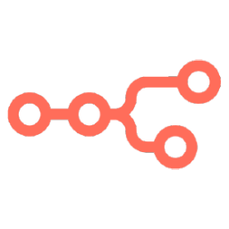

# n8n CI/CD pipeline

Deploy n8n server with CI/CD on Elestio

 
 

# Once deployed ...

You can open n8n UI here and first register with the email below:

    URL: https://[CI_CD_DOMAIN]
    login: [ADMIN_EMAIL]
    password: [SOFTWARE_PASSWORD]

More information about n8n usage can also be found in the documentation.: https://docs.n8n.io/

# Note: 
By default, automatic data pruning is enabled for execution logs, and the record should be deleted 14 days after execution.

If you want to enable/disable or change the number of hours then you can do it by:
Open Elestio dashboard > Service overview > Click on the "Update Config" button > "Docker Compose" tab then edit 'EXECUTIONS_DATA_PRUNE', & 'EXECUTIONS_DATA_MAX_AGE' in the environment and click the button 'Update & Restart'.

# Custom domain instructions (IMPORTANT)
By default, we establish a CNAME on the elestio.app domain. However, you may prefer to use your own domain. In that case, please follow the steps outlined below.

***Step1:*** Add your domain in the Elestio dashboard as explained here:

    https://docs.elest.io/books/security/page/custom-domain-and-automated-encryption-ssltls

***Step2:*** Update the environment variables to reflect your custom domain Open Elestio dashboard > Service overview > Click on the Update CONFIG button > Env tab there edit 'DOMAIN' with your real domain and click the button 'Update & Restart'.